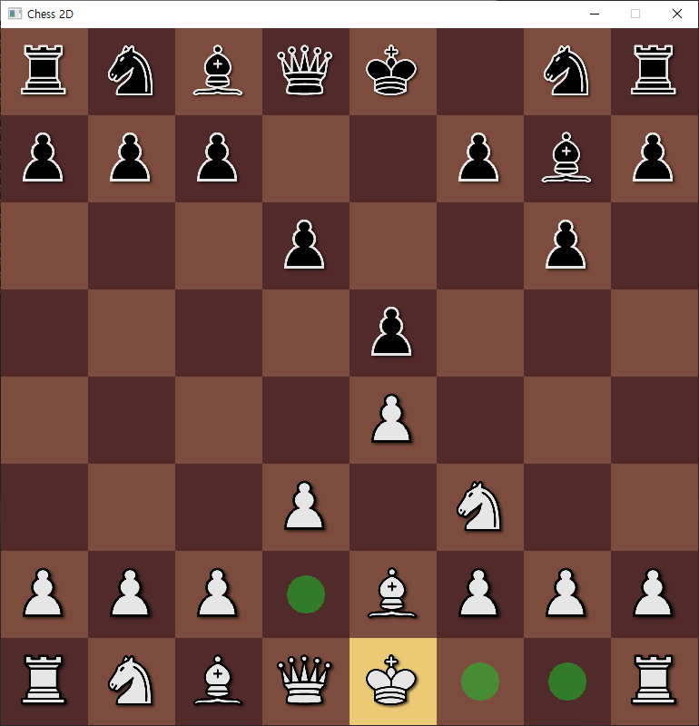
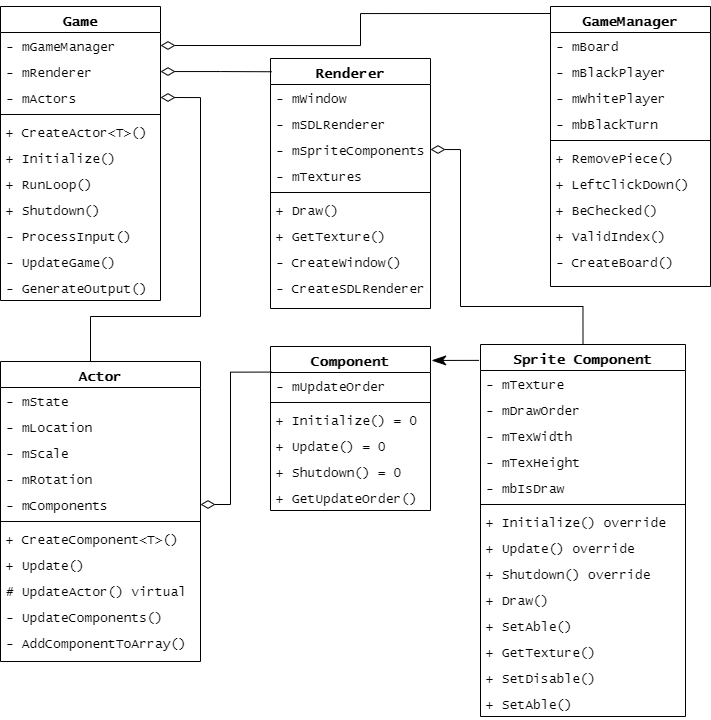
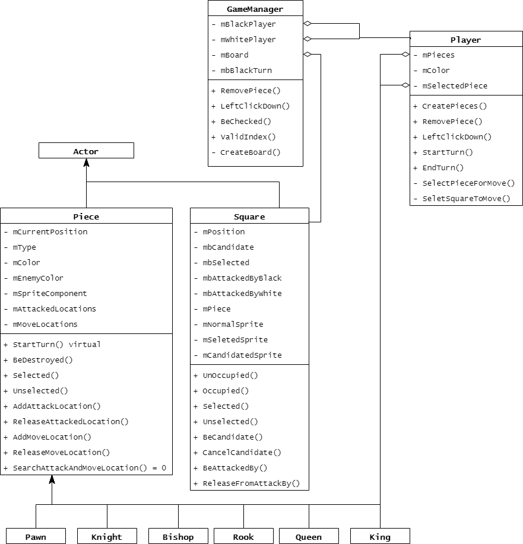

# 자체 제작 프레임워크를 활용한 Chess 2D게임 개요 ♟

- 자체 제작 프레임워크를 구체적으로 구상하기 위해서 2D Chess게임을 제작하게 되었습니다.
- 체스게임의 구현도 중요하지만, 재사용 가능한 게임 프레임워크를 구현하는데 중점을 맞추고 이번 프로젝트를 진행하였습니다.
- 스마트 포인터를 활용하여 더욱 안전하면서도 템플릿을 활용하여 코드의 재사용성을 높이기 위해 노력하였습니다.
- 게임 프레임워크는 Core 폴더에, Chess게임만의 로직은 Source 폴더로 분리하여 게임 프레임워크 코드의 재사용성을 높이기 위해 노력하였습니다.



## 게임 프레임워크 역할

- 언리얼 엔진과 비슷한 Actor - Component 관계를 활용하여 게임을 설계할 수 있습니다.
- Sprite Component를 제공하여 2D게임을 제작할 수 있습니다.
- Actor를 상속받아 사용자가 원하는 Actor의 모습을 구체화할 수 있습니다.
- GameManager 클래스를 통해서 특정 게임의 규칙과 리소스를 관리할 수 있습니다.

## 체스 게임 구현 내용

- 자체 제작한 게임 프레임워크를 활용하여 64개의 Square Actor와 32개의 Piece Actor를 생성하였습니다.
- 모든 기물은 게임 규칙에 맞는 움직임을 가집니다.
- 앙파상, 캐슬링 등 특수한 행마에 대해서도 구현하였습니다.

___

## 프레임워크 Core 구조
- 지금까지 제작한 프레임워크의 구조는 다음과 같습니다.



### Game Class

- 게임 초기화, 종료 및 게임의 메인 반복문을 담당합니다. 메인 반복문에서는 아래의 크게 아래의 3가지 동작을 실행합니다.
    - `ProcessInput()` : 플레이어의 입력을 받고 처리합니다.
    - `UpdateGame()` : 매 프레임 게임의 상황을 갱신합니다. 특히 모든 Actor의 `Update()` 함수를 호출합니다.
    - `GenerateOutput()` : Renderer를 활용한 출력을 담당합니다. 현재는 2D Sprite 출력만 진행합니다.
- 출력을 위한 Renderer를 생성하며, 게임의 규칙 및 로직을 담당하는 GameManager를 생성합니다.
- 모든 Actor객체가 저장되는 `mActors` 배열을 가지고 있으며, Actor를 생성 및 제거할 수 있습니다. Actor를 안전하게 관리하기 위해서 스마트 포인터를 활용하며, 재사용성을 높이기 위해서 템플릿을 활용하였습니다.

```cpp
template<class T, class... Param>
std::shared_ptr<T> Game::CreateActor(Param&&... _Args)
{
    // Actor의 파생클래스가 아닐경우 컴파일 에러처리
    static_assert(std::is_base_of<Actor, T>::value, "Template argument T must be a derived class from the Actor class");

    std::shared_ptr<T> actor = std::make_shared<T>(std::forward<Param>(_Args)...);
    actor->Initialize();
    AddActorToArray(std::static_pointer_cast<Actor>(actor));
    return actor;
}
// 아래와 같이 사용할 수 있습니다.
// CreateActor<Knight>(...);
// CreateActor<Square>(...);
```

### Renderer Class

- SDL window 와 SDL Renderer를 생성합니다.
- 게임에 존재하는 모든 SpriteComponent를 그려질 순서대로 정렬된 동적 배열로 관리합니다.
- 순서대로 저장된 SpriteComponent를 순서대로 화면에 출력합니다.

### Actor Class

- Unreal Engine처럼 각 게임에서  Actor를 상속받아 게임에 필요한 객체를 제작할 수 있습니다.
- Actor는 `EActive` , `EPaused` , `EDead` 상태를 가집니다.
- Actor는 자신의 Transform을 가집니다.
- Actor는 필요한 Component를 생성하여 기능을 확장할 수 있습니다.  Component를 생성하는 방법은 `CreatActor` 함수와 마찬가지로 스마트 포인터와 탬플릿을 활용하여 안정성과 재사용성을 높였습니다.
- 그리고 Actor는 Component의 `mUpdateOrder` 순서대로 정렬된 동적 배열 `mComponents` 를 가집니다.

### Component Class

- 각 Component는 Actor에서 생성 및 관리됩니다. 모든 Component의 기본 클래스입니다.
- 기본 Component는 그 자체로는 아무런 기능이 없는 추상클래스입니다.
- Component는 `Update()` , `Initialize()` , `Shutdown()`  인터페이스를 제공합니다.

### SpriteComponent Class

- Sprite를 그리기 위한 목적으로 Component 클래스를 상속받아서 만든 클래스입니다.
- SpriteComponent는 Actor의 `mComponents` 배열에는 `mUpdateOrder` 순으로 저장되며, Renderer의 `mSpriteComponents` 에서는 `mDrawOrder` 순으로 저장됩니다.
- `Draw()` 함수를 통해서 SpriteComponent가 가지고 있는 텍스처를 Actor의 위치, 크기, 회전에 맞게 화면에 출력하는 기능을 가졌습니다.
- `SetAble()` 함수와 `SetDisable()` 함수를 활용하여 그리기 활성화 및 비활성화를 할 수 있습니다.

### GameManager Class

- 게임 규칙 및 플레이어를 관리하고 직접적인 게임의 로직을 담당하는 class 입니다.
- GameManager를 통해서 게임의 프레임워크 코드와 게임 로직 코드를 분리 및 연결 할 수 있습니다.
- Game이 생성될 때 GameManager가 생성되며 게임에 필요한 데이터들을 로딩 합니다. 이번 2D Chess 프로젝트에서는 게임에 필요한 객체들을 모두 이곳에서 생성합니다.

___

# Chess 2D 게임 구조
- Chess 2D 게임 구조는 다음과 같습니다.



## Piece Class

- Actor의 자식 클래스로, 체스 기물들의 공통적인 특징들이 정의되어 있습니다.
    - Piece는 기물의 색상, 타입, SpriteComponent, 현재 공격지역, 이동 가능 지역을 가집니다.
    - Piece의 턴을 시작하고, 파괴되고, 선택되는 등의 행동을 멤버함수로 정의하였으며, 다음 이동가능지역과 공격지역을 탐색하는 `SearchAttackAndMoveLocation()` 함수를 순수 가상함수로 선언하여 각 기물의 특성에 맞게 재정의하도록 강제하였습니다.
- Pawn, Knight, Bishop, Rook, Queen, King 기물들은 Piece 클래스를 상속받아 각자 기물들의 행마 규칙에 맞게 Piece의 멤버함수들을 재정의하였습니다.
    
    

### Square Class

- Square는 체스 판의 하나의 사각형을 의미합니다. GameManager 객체에서 8*8 2차원 배열 `mBoard` 를 활용하여 64개의 Square를 생성 및 관리합니다.
- Square는 `mNormalSprite` , `mSeletedSprite` , `mCandidatedSprite` 3가지의 SpriteComponent를 가지며 상황에 맞게 Sprite를 출력할 수 있습니다.
- Square는 현재 Square에 점유중인 Piece의 정보와 공격하고 있는 Color의 정보등을 가지고 있어서 기물들이 다음 움직임을 결정할때 많이 참조됩니다.

### Player Class

- 체스에는  Black, White 두 가지 색상 2명의 플레이어가 존재합니다. GameManager에서 색상별 Player를 멤버변수로 가집니다.
- 플레이어는 자신의 차례에 `LeftClickDown()` 함수에서 아래의 두 멤버함수를 호출하여 기물을 선택하고 이동 지역을 선택합니다.
    - `SelectPieceForMove()` : 이동할 기물 선택
    - `SeletSquareToMove()` : 이동할 지역 선택. 이동 후 턴 종료
- 자신의 차례가 시작될 때 `StartTurn()` 함수가, 자신의 차례가 종료될 때 `EndTurn()` 함수가 호출되어 기물들의 공격 중인 지역을 담은 배열 `mAttackedLocations` 과 기물들의 다음 이동 가능 지역을 담은 배열 `mMoveLocations` 을 갱신됩니다.
